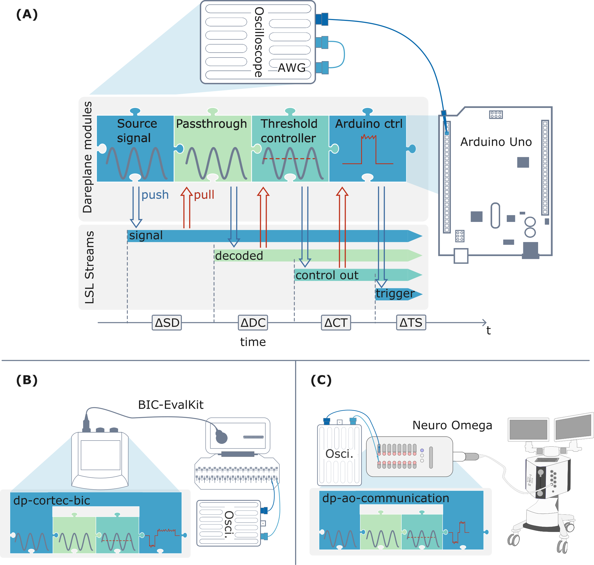

# Dareplane paper module collection

This repo collects the [Dareplane](https://github.com/bsdlab/Dareplane) modules used during the benchtop experiments of the Dareplane paper:
[https://arxiv.org/abs/2408.01242](https://arxiv.org/abs/2408.01242) (preprint).

All raw data and analysis scripts, including for the patient and c-VEP experiments, is available at the Radboud data repository - [https://doi.org/10.34973/d214-m342](https://doi.org/10.34973/d214-m342).

All test setups used the [dp-passthrough](https://github.com/bsdlab/dp-passthrough) and [dp-threshold-controller](https://github.com/bsdlab/dp-threshold-controller).

- During the Arduino experiments the [dp-picoscope-streamer](https://github.com/bsdlab/dp-picoscope-streamer) module was used for collecting data from the Picoscope and to activate the AWG. The [dp-arduino-stimulator](https://github.com/bsdlab/dp-arduino-stimulator) was used to communicate a control value via the serial connection, which would then result in the GPIO switch.

- During the experiment with the CorTec BIC EvalKit, the [dp-cortec-bic](https://github.com/bsdlab/dp-cortec-bic) module was used to read from the EvalKit and to trigger a single stimulation pulse whenever the control value exceeded the threshold.

- During the experiment with the Neuro Omega, the [dp-ao-communication](https://github.com/bsdlab/dp-ao-communication) was used for streaming data from the Neuro Omega using the C++ API. Additionally, the [dp-ao-stimulator](https://github.com/bsdlab/dp-ao-stimulator) was used to communicate with the TCP server of the [dp-ao-communication](https://github.com/bsdlab/dp-ao-communication). This is bypassing e.g., the use of the [dp-control-room](https://github.com/bsdlab/dp-control-room), which would spawn a GUI, creating additional CPU load not necessary for the performance test.

